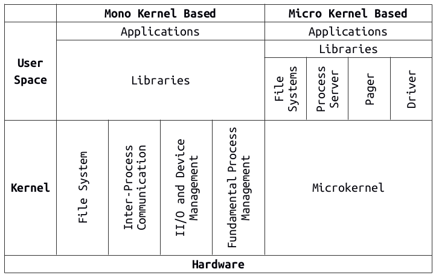
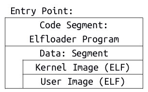
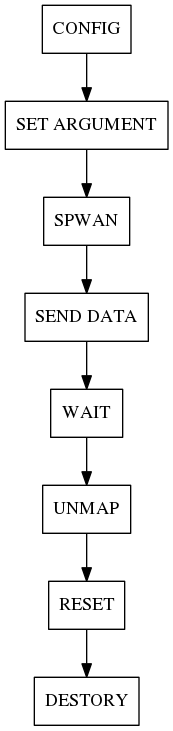
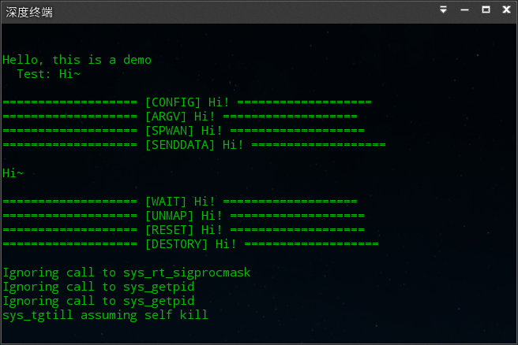

基于seL4微内核的研究：移植与开发
============================

<!-- MarkdownTOC -->

- 绪论
    - 微内核发展与现状
    - L4微内核家族
    - 内核形式化验证
- 基本原理与源码分析
    - 嵌入式系统加载过程
    - seL4内核源码分析
    - seL4支持库
- seL4微内核移植
    - bootloader参数设置
    - 平台支持移植
    - 内核测试
- 编程模型设计
    - IPC编程模型
    - 内存管理设计
    - 串口通信抽象
    - A Demo
- 总结与展望
    - 工作总结
    - 微内核未来展望
- 参考文献
- 附录
    - 附录A
    - 附录B
    - 附录C

<!-- /MarkdownTOC -->


# 绪论

<!-- 绪论应说明本课题的意义、目的、研究范围及要达到的技术要求；简述本课题在国内外的发展概况及存在的问题；说明本课题的指导思想；阐述本课题应解决的主要问题。 -->

L4是一组基于微内核架构的操作系统内核。五年前，澳大利亚研究组织NICTA创造了一个新的L4版本，称为Secure Embedded L4，宣布在世界上率先开发出第一个正规机器检测证明（formal machine-checked proof）通用操作系统。seL4微内核设计针对实时应用，可潜在应用于强调安全和关键性任务的领域内。该系统的开源版本包括所有seL4内核源码、证明和规范，再加上过去五年中开发的一系列额外的程序，如工具、库和可用于建立可信系统的示例程序。

本课题将针对seL4微内核进行学习研究和开发，并完善seL4的上层模型，最终希望能基于seL4构建一个可靠的安全操作系统，从而应用于对安全性要求高的领域中，如轨道交通控制系统。但由于seL4的当前版本对硬件设备的支持度还很低，支持的硬件平台还很少，现阶段的主要工作将围绕内核源码的可移植性开展。

本文主要介绍了在实习中开展的一系列针对seL4微内核移植与开发的工作，同时深入剖析了seL4微内核的开发原理与源代码，为后期的开发工作提供帮助与支持。内核源码移植工作与Kortide公司合作开展。作为工作的一部分，seL4微内核对OMAP4平台的移植源码可在Elastos开源社区的gerrit代码库中免费获取。

## 微内核发展与现状

<!-- 主要介绍微内核基本原理、设计思想、发展历史以及发展现状 -->
对于操作系统这一概念，至今并没有很权威的通用定义。它一般用来指称向下管理计算机体系结构及相关硬件设备，向上为用户提供基础服务的一类计算机软件程序。广义上讲的操作系统是指内核以及建立在内核上的一系列系统服务构成的软件集合，操作系统的程序被分为两部分：一部分工作于非特权模式；而另一部分工作于特权模式，被称为内核。狭义上讲，内核即是操作系统本身。

<!-- 什么是操作系统内核 -->
操作系统内核是为操作系统提供核心服务的程序。它工作在CPU的特权模式下，为计算机设备提供最基础的抽象服务，并向上层提供基本接口管理计算机。在现代通用电子计算机中，软件程序根据其工作的层次以及和内核的相关程度分为两类[1]：一类是操作系统内核相关的程序，但不是内核工作的必要部分，通常被称为*系统程序*；另一类是和计算机系统的操作管理无关的程序，就是我们常说的*应用程序*。

<!-- 操作系统内核发展：微内核VS宏内核 -->
关于操作系统内核的设计与实现有着不同的方法，但大体上可分为两种类型：宏内核（mono kernel）与微内核（micro kernel）。传统的PC操作系统，如Windows、UNIX或者Mac OS都属于宏内核的设计。而随着计算机体系结构的日趋复杂，操作系统的设计也日渐复杂化。于是，大量的代码开始堆积在操作系统中，这使得操作系统的代码变得原来越难以维护。于是，分歧出现了。[2]

一部分操作系统的设计者趋于将复杂的设备管理、进程管理以及文件系统等服务在内核模式下运行，这使得内核代码变得越来越复杂。而另一部分人[3]提出了，将复杂的系统服务转移到用户模式下执行，而内核只保留必要功能的极小化设计思想。以这种设计思路而诞生的操作系统内核即被称为微内核。

下图描述了基于宏内核与微内核两种不同设计思想的操作系统架构的对比。



<!-- 微内核的发展史：第一代、第二代、第三代 -->
微内核的发展经过了将近三十年的历史。最初以微内核思想设计的操作系统内核是Mach，它由卡内基梅隆大学开发，也被称为第一代微内核。然而Mach仍然过于复杂，它的代码量并不少，并且在可移植性与IPC的时间开销上处理地也并不令人满意。这些问题被Liedtke于1996年在一篇论文[4]中所指出。Liedtke的工作是伟大的，他认为Mach的时间开销问题并不是微内核本身的原因造成的，微内核应该可以更快更简洁。于是他提出一种全新的微内核设计，并命名为L3。多年之后，他又对L3微内核的设计进行了改进，优化了IPC的性能，使微内核真正变得有实用价值，于是诞生了L4微内核。因其对上一代微内核性能的极大改进，L4微内核又被称为第二代微内核。

L4微内核的诞生使微内核迅速发展，各个机构都纷纷开始基于L4微内核发展自己的微内核。于是构成了L4微内核的家族。直到NICTA与UNSW开发出了被称为第三代微内核的seL4——首个宣称被完全形式化验证了的微内核。[5]

## L4微内核家族

<!-- 介绍L4微内核家族及发展史 -->
Mach的设计是由Mono Kernel改进而来的，并不能称为完全的微内核，现在普遍将其称为混合内核（Hybrid Kernel）。[6]而如同GNU/Linux操作系统的发展，L4微内核的分支也繁多，于是构成了一个庞杂的微内核家族。我们称之为L4微内核家族（L4 microkernel family）。其中比较有名的，如L4Ka[7]、L4/MIPS[8]、Fiasco[9]等，都在学术界有着重要意义。而L4-embed[10]更是希望将L4推向商业市场。

## 内核形式化验证

<!-- 软件形式化验证的基本理论，以及在微内核上的应用 -->
内核为操作系统及其上的应用程序提供最基础的服务，且工作在CPU特权模式下。操作系统的设计趋向于用户程序无条件信任内核程序，这就对内核程序的正确性和可靠性提出了极高的要求。

<!-- 昝略：形式化验证基本原理介绍 -->
软件测试只能验证软件不可靠，却无法证明软件是可靠。而形式化验证的方法可以严格的证明软件系统的安全可靠。形式化证明分为两种方式：模型检测与定理证明。目前对于系统软件，普遍采用定理证明的方法。其中以Isabelle/HOL[11]定理自动证明机最为著名。seL4微内核即采用该方法进行形式化验证。

# 基本原理与源码分析

<!-- 正文主体是对研究工作的详细表述，其内容包括：问题的提出，研究工作的基本前提、假设和条件；模型的建立，实验方案的拟定；基本概念和理论基础；设计计算的主要方法和内容；实验方法、内容及其分析；理论论证，理论在课题中的应用，课题得出的结果，以及对结果的讨论等。学生根据毕业设计(论文)课题的性质，一般仅涉及上述一部分内容。 -->
在针对seL4微内核进行平台移植和开发之前，有一些准备工作需要完成。这些工作主要包括两部分：

1. 对目标嵌入式平台的系统加载过程的分析；
2. 对seL4相关源代码的分析。

## 嵌入式系统加载过程

一般的计算机系统，在CPU上电启动开始工作后，操作系统启动之前，会首先加载一段启动程序。其目的是初始化计算机的各个硬件设备，并将操作系统的内核从off-line的存储设备中加载到计算机的主存储器，然后使指令指针跳转到内核入口，从而使操作系统开始正常工作。

### Bootloader技术

通过启动程序来加载操作系统的技术被称为Bootloader技术。在个人计算机中，这段程序通常都是固化在主板的一块固定的存储区域上，它自身构成一个小系统并能访问计算机的设备资源，被称为BIOS。而在嵌入式计算机中，启动程序通常需要用户来烧写，并且具有更强的可定制性。

<!-- U-Boot基础及原理 -->
Das Universal Bootloader（简称U-Boot）是目前嵌入式系统中最常用的一种启动程序[12]。U-Boot作为开源软件，有德国DENX提供和维护，几乎支持现存的所有嵌入式平台设备。包括PowerPC、ARM、MIPS等多个处理器架构。

### OMAP4平台的Bootloader分析

<!-- 参见OMAP4及pandaboard的官方wiki -->
我们的目标设备是PandaBoard开发板。它是由TI公司设计的基于OMAP4640平台的嵌入式开发板。首先我们需要分析OMAP平台的系统启动过程。

在OMAP平台中，系统内核加载启动需要经过多个阶段：

- ROM代码部分：
    - CPU上电工作之后，首先会通过初始化指令启动ROM上一块特定地址区域的代码。
    - 初始化时钟、内存以及外围设备的配置。
    - 搜索各个可引导设备，查找引导镜像。
    - 将X-Loader载入SRAM并执行。
- X-Loader阶段：
    - 设置板上引脚选择。
    - 为时钟及内存进行初始化。
    - 将U-Boot载入SDRAM并执行。
- U-Boot阶段：
    - 进行平台其他部分的初始化。
    - 进行boot参数的设置。
    - 加载kernel到主存储器。
- Kernel阶段：
    - 内核启动并进行bootstrap，然后逐步加载起整个操作系统。

### U-Boot加载过程及源码分析

<!-- U-Boot简单过程分析，不包括DHCP等部分 -->

X-Loader阶段和U-Boot阶段是依赖于用户向可引导设备，如NAND Flash和SD
Card，烧写的bootloader程序而启动的。ROM CODE部分是固化在片上的程序，用户不可改，而Kernel属于操作系统部分，因此X-Loader和U-Boot是OMAP4平台bootloader的主要阶段。故OMAP4平台的bootloader也被称为两阶段boot。[13]

这两部分启动程序的镜像均可以由U-Boot源码编译生成。

**获取U-Boot源码**

可以从denx.de的git库中获取最新版的U-Boot源码：

```
git clone git://git.denx.de/u-boot.git
```

我们也在ElastOS的Git库中备份了一份：

```
git clone http://elastos.org/review/PandaBoard/U-boot
```

**U-Boot目录树**

```
/arch           针对不同处理器架构的配置 *
/api            为扩展应用提供的与机器/架构无关的 API
/board          定义不同开发板的依赖配置 *
/common         MISC 架构的独立函数 *
/disk           对磁盘驱动器分区处理的支持
/doc            文档
/drivers        常用设备驱动
/dts            构建内置 U-Boot FDT 的Makefile
/examples       一些独立应用程序的示例代码
/fs             文件系统支持 (cramfs, ext2, jffs2, etc.)
/include        头文件 *
/lib            所有处理器架构通用的库文件
/net            网络支持
/post           Power On Self Test
/spl            二级程序载入框架 (Secondary Program Loader)
/tools          构建 S-Record, U-Boot images 等的工具
```

以下对几个主要目录进行简单的说明：

arch: 在低版本的U-Boot中命名为cpu，该目录主要定义了针对不同特定CPU架构的配置。该目录下每个子目录对应一种特定CPU架构分类，子目录的至少都包含cpu, include, lib这三个二级子目录。其中目录cpu中包含在该CPU架构分类下的不同版本。每一个cpu版本至少包含一个start.S文件，这个文件定义了全局开始启动的代码。

board: 该目录主要针对不同平台的开发板进行相关配置，对于U-Boot支持的每一种开发板，都会在该目录下有自己的子目录。而对于一些主流硬件厂商，如TI, Xilinx等，同一厂商的开发板会组织为各自厂商目录的二级目录。

common: 该目录主要定义了实现U-Boot命令行下各种命令支持的代码。每一条具体的命令，都有对应的文件，文件的命名以cmd_开头。在include中有对各命令是否被使用的支持。

include: 该目录包含了U-Boot的使用的各种头文件，包括U-Boot命令行控制、系统配置、文件系统支持、硬件驱动、硬件平台相关的各类头文件定义。其中config_cmd_all.h和config_cmd_default.h两个文件定义了U-Boot命令行中将编译和使用哪些命令。

关于U-Boot更详细的源码分析，在附录A中。

## seL4内核源码分析

在对seL4进行内核移植之前，需要弄清seL4源码的组织结构，以及各部分的基本工作原理。

### 目录结构剖析

关于seL4的目录结构剖析。

一个基于seL4微内核的工程项目，其源代码一般包含以下几部分：

1. kernel目录：包含了seL4微内核的完整源代码；
2. libs目录：包含用户模式下的程序需要引用的C库，如libmulsc等平台无关的C标准库；
3. apps目录：包含所有用户模式下的程序，通常一个子目录定义了一个用户态的进程；
4. configs目录：包含预定义的Makefile配置文件。
5. 顶层Kbuild文件：定义顶层Kbuild系统的规则
6. 顶层Kconfig文件：配置config文件的规则
7. 顶层Makefile文件：定义GNU/Make系统的规则

seL4的工程基于GNU的Kbuild系统构建，通过Kconfig的配置对工程目录进行自顶向下的递归构建。顶层Kbuild的目标是生成可被U-Boot引导加载的elf镜像。

在工程成功构建后，还会生成以下目录和文件：

1. build目录：工程构建后生成的目标文件（\*.o）和二进制文件（\*.bin）；
2. stage目录：工程构建过程中产生的临时文件，主要根据.config中的配置，从源码中提取和构建目标相关的部分源代码；
3. include目录：构建过程中用到的头文件；
4. tools目录：构建过程中用到的工具脚本；
5. images目录：用于存放生成的最终目标镜像；
6. .config文件：读取config目录中相关配置文件生成的Make系统配置文件。

kernel目录包含了seL4微内核的完整源代码，该目录的顶层结构如下：

1. haskell目录：使用haskell和HOL系统进行内核形式化验证的源码，包括seL4的haskell原型定义；
2. src目录：内核的C实现源码；
3. include目录：内核的C实现头文件；
4. libsel4目录：内核所需的C库；
5. tools目录：内核构建所需的脚本工具，包括链接符号生成、ELF格式支持和内核镜像生成等；
6. Kconfig文件：对Kbuild系统和menuconfig支持的配置文件；
7. LICENSE\_BSD2.txt和LICENSE\_GPLv2.txt：开源许可证。

kernel的C实现源码主要包含以下几部分：

1. api目录：定义seL4微内核向上层抽象提供的服务接口；
2. model目录：内核中用到的数据模型和数据结构定义；
3. object目录：Capability、VSpace等内核对象的定义；
4. kernel目录：内核管理相关源码；
5. arch目录：CPU处理器架构相关代码；
6. plat目录：设备平台相关代码；
7. machine目录：嵌入式系统平台系列相关代码；
8. assert.c：定义内核中需要的断言；
9. inlines.c：定义内核中需要的内联函数；
10. util.c：一些简单实用的函数定义。

### 内核启动过程

seL4的kernel启动需要经过三个阶段：

1. elfloader阶段；
2. kernel初始化阶段；
3. 线程启动阶段。

**elfloader阶段**

U-Boot加载kernel镜像到RAM并执行后，首先进入seL4的elfloader程序。这是因为seL4的镜像是被这样打包的：



在seL4的镜像中，kernel程序和userspace程序都被打包成ELF格式[14]的数据块,存储在elfloader程序的数据段。

当seL4镜像被执行时，将完成三个动作：

1. 解包数据段kernel程序和userspace程序的ELF镜像，将其重新加载内存；
2. 启用MMU，并对内存地址空间进行虚拟地址映射；
3. 以C方式传递userspace镜像的描述参数，并跳转到kernel程序入口。

**kernel初始化阶段**

该阶段是seL4内核的核心部分，用于初始化seL4内核的内核对象和各项服务。

主要包括五个方面：

1. 内核映像的地址映射
2. CPU初始化
3. 平台相关初始化
4. 空闲内存管理初始化
5. Capability及线程初始化

最终将生成一个bootinfo结构，包含对所有内核对象的引用。这个结构将传递给初始线程，使初始线程能够调用内核服务。

对于这些的详细注解，参见附录B。

**线程启动阶段**

bootinfo构造完成后，kernel初始化程序将返回并跳转到初始线程入口。

### 硬件支持

seL4内核的硬件支持，主要是指seL4对不同嵌入式硬件设备的支持。

seL4的设计思想是极小化的，即“只有一个功能当被认为是必要时，才会被放入内核中”[15]。因此，硬件驱动的支持并不由seL4的内核来实现，seL4只支持一个硬件驱动，那就是Timer[16]。故，这里提到的硬件支持只要涉及三个方面：CPU架构、嵌入式平台、片上系统。它们分别被定义在arch、plat和machine目录中。

arch定义了指令集和处理器架构相关的内容。包括对armv5、armv6、armv7的支持。

plat定义了对特定硬件平台的接口，这主要包含两方面：地址接口的定义和硬件功能的定义。地址接口以宏的形式定义在头文件中，包括物理地址的定义和虚地址定义。功能定义主要用来定义对于不同平台的Timer时序。

machine定义了对于不同片上系统，包括Cortex-A8、Cortex-A9和Cortex-A15等的相关设备。其中包括GIC通用中断控制器、L2 Cache Controller。

### 内核对象

seL4的内核对象管理是基于Capability访问控制的，这种机制广泛应用于操作系统的内核设计中[16]。seL4的内核对象主要包括CNode、TCB线程控制块、IPC Endpoints、Vspace对象、Interrupt对象和Untyped Memory对象。其中Vspace和Interrupt是和处理器架构相关的，而其他对象是架构无关的。

seL4具有IPC机制，进程间的通信需要建立Endpoint来完成。Endpoint对象分为两种类型：普通的Endpoint是同步的，消息的传递需要进行同步等待；AnsycEndpoint用于异步通信，消息传递和内核其他服务是异步执行的。

## seL4支持库

除了seL4内核部分外，seL4还提供了一些实用的C库用于构建用户模式下运行的系统程序。

这些库主要包括以下几部分：

+--------------------+------------------------------+
| C库                | 功能                         |
+====================+==============================+
| libelf             | ELF格式支持，用于读取ELF镜像 |
+--------------------+------------------------------+
| libcpio            | 用于镜像文件归档处理         |
+--------------------+------------------------------+
| libmuslc           | 系统无关C标准库              |
+--------------------+------------------------------+
| libplatsupport     | 对平台特定硬件驱动支持的库   |
+--------------------+------------------------------+
| libsel4muslcsys    | 系统相关C标准库              |
+--------------------+------------------------------+
| libsel4allocman    | 用于内存管理和分配机制的算法 |
+--------------------+------------------------------+
| libsel4platsupport | 面向用户程序的平台支持库     |
+--------------------+------------------------------+

Table1: C Library of seL4

seL4的内核本身不提供动态链接机制，所有这些库都是在工程构建时静态的链接到用户程序中的。

# seL4微内核移植

seL4内核的haskell原型对硬件的抽象是有限的，并不能保证其可移植性。我们以下所做的工作均是对其C语言实现的移植。这包括三个方面：

- bootloader的移植与参数设置
- 面向平台移植
- 内核服务测试

## bootloader参数设置

U-Boot的可移植性是由DENX对Das U-Boot本身的设计决定的，在U-Boot源码的dts设备树中已包含对TI的OMAP4平台支持。但是这里仍然有两点工作需要去完成。

**bootelf命令支持**

seL4的镜像是ELF格式的，我们必须修改U-Boot源码，使其支持对ELF格式镜像的加载。

U-Boot对命令的支持由源码include目录中的config\_cmd\_all.h和config\_cmd\_default.h两个头文件进行宏定义。其中config\_cmd\_all.h定义的所有命令将不被编译，而config\_cmd\_default.h中定义的命令将被编译进U-Boot镜像。

定义bootelf命令的宏CONFIG\_CMD\_ELF默认是不被启用的。要使U-Boot支持bootelf功能，需要添加宏CONFIG\_CMD\_ELF的使能。将下列代码插入config\_cmd\_default.h文件的末尾即可。

```
...

/* Custom Define */
#define CONFIG_CMD_ELF        /* Enable bootelf, bootvx    */

#endif    /* _CONFIG_CMD_DEFAULT_H */
```

**uboot环境参数设置**

我们还必须考虑设备的内存空间编址，将镜像加载到有效的内存地址中去。

我们的目标设备是PandaBoard嵌入式开发板。该设备的主存储器大小为512MB，其RAM的地址空间为0x80000000-0xC0000000。为尽量减少内存的浪费，我们通常将内核镜像加载到内存的起始地址处。

回顾“OMAP4平台的Bootloader分析”一节，U-Boot阶段在加载kernel之前会进行参数设置。这些参数通常定义在一个名为uEnv.txt的文件中。我们希望能够正常寻址到内核镜像并加载成功，必须进行如下参数配置：

```
uenvcmd=if fatload mmc 0 0x80000000 omap4-eabi; then bootelf 0x80000000; fi;
```

这会将名为omap4-eabi的镜像从0号MMC设备读取到内存地址为0x80000000的空间上，并按照ELF格式进行引导启动。

## 平台支持移植

我们的核心工作是对内核进行平台支持的移植。然而seL4内核对可移植性的设计是欠缺的，既没有采用一种对平台和设备松耦合的定义，也没有比较全面的设备定义规范。

我们在实际工作中总结了seL4面向平台支持的几个主要接口：

**需要添加的定义及结构**

```
kernel/src/plat/<plat>/ [+]
├── linker.lds
├── machine
│   ├── hardware.c
│   ├── io.c
│   ├── l2cache.c (*)
│   ├── Makefile
│   └── timer.c (*)
└── Makefile

kernel/include/plat/<plat>/ [+]
└── plat
    ├── machine
    │   ├── debug_helpers.h
    │   ├── devices.h
    │   ├── hardware.bf
    │   ├── hardware.h
    │   ├── io.h
    │   └── Makefile
    ├── machine.h
    └── Makefile

tools/elfloader/src/arch-arm/palt-<plat>/ [+]
├── platform_init.c
└── sys_fputc.c
```

以上文件是对于一个新增的设备支持所必须添加的定义，共包括三个主要目录，用`[+]`标记。其中带`(*)`标记的是可选定义，`<plat>`用来指代特定的设备平台。

**需要修改的配置及文件**

```
kernel/Makefile [M]
kernel/Kconfig [M]
tools/common/Makefile.flags [M]
tools/common/files_to_obj.sh [M]
tools/elfloader/Makefile [M]
tools/elfloader/gen_boot_image.sh [M]
```

为使工程能够成功构建并生成出面向特定设备的镜像，上述文件是必须被修改的，因此这里用`[M]`进行了标记。

**面向用户程序静态C库的修改**

```
Need by User Mode:
libs/libplatsupport/src/mach/<mach>/ [+]
libs/libplatsupport/mach_include/<mach>/ [+]
libs/libplatsupport/plat_include/<plat>/ [+]

Need by sel4test:
libs/libsel4platsupport/src/mach/<mach>/ [+]
libs/libsel4platsupport/mach_include/<mach>/ [+]
libs/libsel4platsupport/plat_include/<plat>/ [+]
```

上述定义需要新增到响应的C库中。其中，libplatsupport的新增用于用户模式下的程序对平台的支持；libsel4platsupport的新增用于sel4test内核测试程序对平台的支持。

**新增config定义**

```
configs/<plat>_*_defconfig [+]
```

除此之外，还需要新增一个config文件到configs目录下，以配置整个Kbuild系统能够正确读取在上述修改中的相关定义。这一文件不需要手动添加，可以通过运行`make config`命令而自动生成。

## 内核测试

为确认移植后的内核各项服务是否能够正常工作，我们还需要设计测试用例对内核进行测试。

所有的测试程序需要在`apps/sel4test-tests/src/tests`目录下进行定义。该目录下已包含了23个测试文件以及定义在上面的69个测试用例。但是这些测试用例还并不完整，不能完全满足我们的需求。我们还需要添加自己测试用例。

我们定义的测试用例很简单，只有一个文件，用来测试系统的内存堆分配算法：

```
#include <sel4/sel4.h>

#include "../helpers.h"
#include <allocman/vka.h>

static int
test_vka_allocator(env_t env, void *args)
{
    int err;
    allocman_t *a = env->vka.data;
    void *mem = a->mspace.alloc(a, a->mspace.mspace, 10, &err);
    if (mem) {
        printf("Testing allocator->mspace.alloc(), num=%d;\n", 10);
        return SUCCESS;
    }

    return FAILURE;
}
DEFINE_TEST(ALLOC0000, "Test allocator", test_vka_allocator)
```

所有测试用例会被顺序加载执行一遍后，再被倒序加载一遍。即所有测试用例均会被系统加载两遍。

# 编程模型设计

除了对内核的面向平台移植，我们还进一步的完善了系统上层模型，并利用IPC模型实现了一个简单的演示Demo。

## IPC编程模型

seL4微内核提供了Endpoint和AyncEndpoint两种内核对象，可以用于进程间通信。

我们在seL4微内核之上设计了基于IPC机制的线程通信编程模型：



## 内存管理设计

seL4微内核使用Untype机制进行内存空间管理，这种机制具有很大的局限性，很难保证大规模系统的良好运行。

为改善系统内存管理，我们采取了以下策略：


## 串口通信抽象

作为一个可交互的演示系统，对串口通信的抽象当然是实现上最简单的交互途径。因此，我们基于UART协议的串口通信抽象出了以下程序交互接口：

```
#define UTHR 0x00 /* UART Transmit Holding Register */
#define URBR 0x00 /* UART Receive Buffer Register */
#define ULSR 0x14 /* UART Line Status Register */
#define ULSR_THRE 0x20 /* Transmit Holding Register Empty */
#define ULSR_DR   0x01 /* Data Ready Register */

#define UART_REG(x) ((volatile uint32_t *)(UART3_PPTR + (x)))

void putDebugChar(unsigned char c)
{
    while ((*UART_REG(ULSR) & ULSR_THRE) == 0);

    *UART_REG(UTHR) = c;
}
```

```
unsigned char getDebugChar(void)
{
        while ((*UART_REG(ULSR) & ULSR_DR) == 0);

    return *UART_REG(URBR);
}
```

## A Demo

我们的演示Demo很简单：名为Hello的初始线程进行了对系统地全局配置，然后向串口输出一句“Hello”，并通过Endpoint传递一个空消息，唤醒另一个名为Hi的线程。线程Hi接收到消息后，向串口发送一句“Hi”。

<!--  -->

我们最终的Demo，以及包括平台移植在内的所有seL4相关源代码，全部打包成了一个patch文件。该文件包含了对seL4项目做出的全部修改，是一个diff报告格式的文件。任何人可以通过打补丁的方式，将这些修改在seL4的test项目上进行重复。完整的patch文件内容参见附录C。

# 总结与展望

微内核的发展至今已有近30年历史。通过这两个月对seL4微内核设计思想、平台移植以及程序开发的研究，我总结了以下几点问题。这些问题是我认为seL4在从面向学术的设计向面向工程的设计发展而必须要面对的。对于任何一个期望商业成功的操作系统内核，这些问题也都是需要考虑到。与此同时，我还对微内核未来可能的发展方向给出了一些展望。

## 工作总结

**系统软件的可移植性设计**

seL4的C实现源码仍然欠缺一种高度可移植的硬件抽象设计。不像Linux内核使用Device Tree机制对硬件和平台进行抽象，seL4源码的硬件相关定义过于松散，缺少一种有着强约束力的硬件接口定义规范。

**关于编码风格**

每个大型项目都会有自己对于编码风格的约定。参考Linux内核开发的编码风格约定[18]，我强烈希望seL4也能定义一个自己的编码风格约定。

**关于软件耦合性**

具有良好的代码复用性的软件系统倾向于松耦合，但seL4整个工程的源码对个别模块耦合性太强。这给移植增加了很大的困难。

## 微内核未来展望

**基于微内核的操作系统设计规范**

随着L4系列微内核在性能上的不断改进，尤其是个别版本的商业成功，相信微内核会越来越多的被使用与操作系统设计。我们亟待推动制定出像POSIX一样的微内核标准接口，方便微内核上层开发的兼容性。

**微内核与云计算**

对于微内核的IPC机制，未来有望发展出更适合云计算平台的操作系统，以提升消息在云服务器与云终端之间的传输效率。

# 参考文献

[1] Silberschatz, A., Galvin, P. B., & Gagne, G. (2013). Operating system concepts (Vol. 8). Wiley.

[2] Roch, B. (2004). Monolithic kernel vs. Microkernel. TU Wien.

[3] Accetta, M., Baron, R., Bolosky, W., Golub, D., Rashid, R., Tevanian, A., & Young, M. (1986). Mach: A new kernel foundation for UNIX development.

[4] Jochen Liedtke. μ-kernels must and can be small. 5th Workshop on Object-Orientation in Operating Systems (IWOOOS), October 1996.

[5] Klein, G., Elphinstone, K., Heiser, G., Andronick, J., Cock, D., Derrin, P., ... & Winwood, S. (2009, October). seL4: Formal verification of an OS kernel. In Proceedings of the ACM SIGOPS 22nd symposium on Operating systems principles (pp. 207-220). ACM.

[6] Tevanian, A. (1987). Mach threads and the Unix kernel: the battle for control.

[7] LeVasseur, J. (2003). L4Ka:: Pistachio powerpc implementation. Working paper, University of Karlsruhe.

[8] Heiser, G. (2001). Inside L4/MIPS: Anatomy of a high-performance microkernel.

[9] Hohmuth, M. (1998). The Fiasco kernel: requirements definition. Techn. Univ., Fakultät Informatik.

[10] Ruocco, S. (2006, July). Real-time programming and L4 microkernels. In Proceedings of the 2006 Workshop on Operating System Platforms for Embedded Real-Time Applications, Dresden, Germany.

[11] Nipkow, T., Paulson, L. C., & Wenzel, M. (Eds.). (2002). Isabelle/HOL: a proof assistant for higher-order logic (Vol. 2283). Springer.

[12] Das U-Boot Wiki. http://www.denx.de/wiki/U-Boot/WebHome. DENX.

[13] OMAP Bootloader. http://omappedia.org/wiki/Bootloader_Project. TI.

[14] ELF Format Specification. http://www.skyfree.org/linux/references/ELF_Format.pdf

[15] Elphinstone, K., & Heiser, G. (2013, November). From L3 to seL4 what have we learnt in 20 years of L4 microkernels?. In Proceedings of the Twenty-Fourth ACM Symposium on Operating Systems Principles (pp. 133-150). ACM.

[16] Derrin, P., Elkaduwe, D., & Elphinstone, K. seL4 Reference Manual. NICTA, 2008.

[17] Henry M. Levy. Capability-Based Computer Systems. http://homes.cs.washington.edu/~levy/capabook/index.html. 1984.

[18] greg@kroah.com. Kernel CodingStyle. http://git.kernel.org/cgit/linux/kernel/git/torvalds/linux.git/tree/Documentation/CodingStyle. OLS, 2002.

# 附录

## 附录A

<!-- U-Boot源码分析详解 -->

## 附录B

<!-- seL4 kernel boot注解 -->

## 附录C

<!-- seL4工程的patch文件 -->