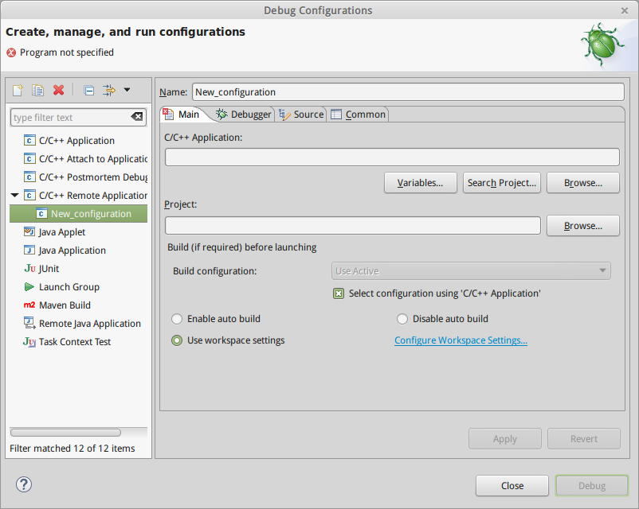
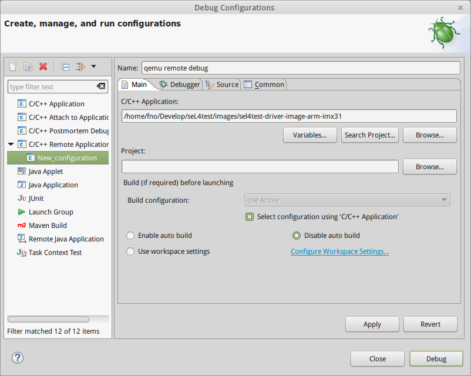
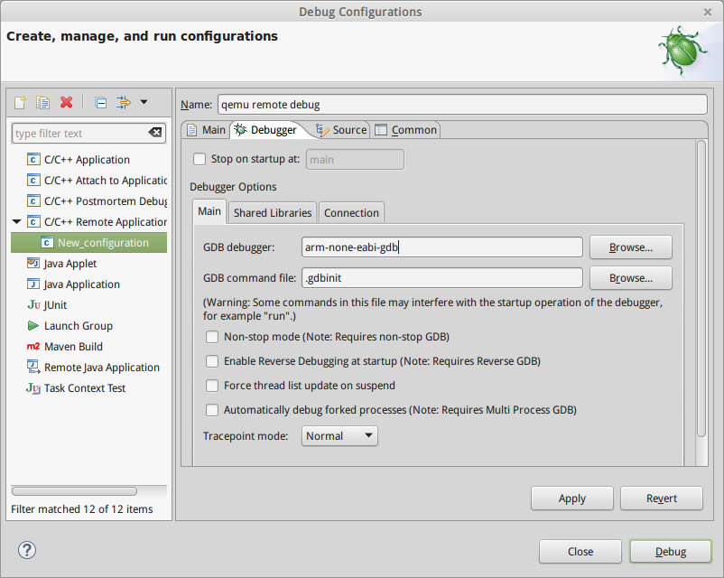
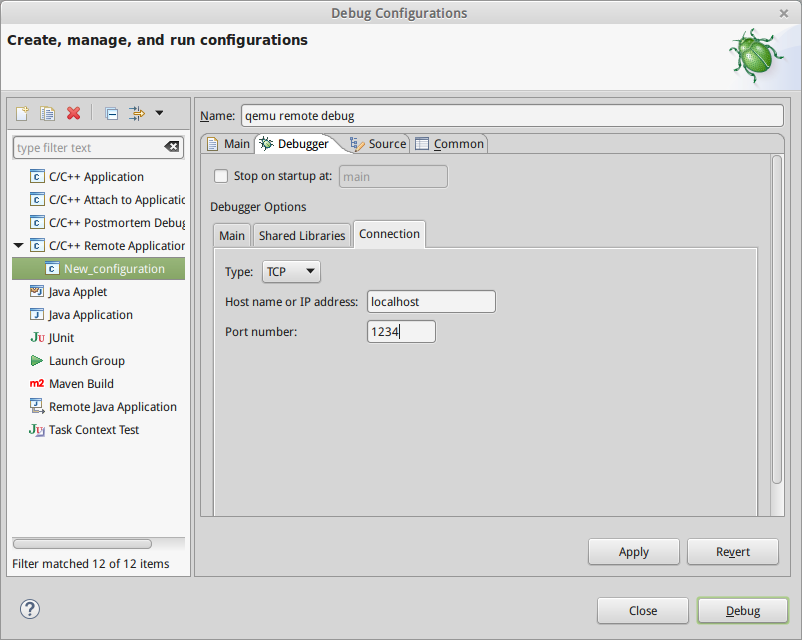
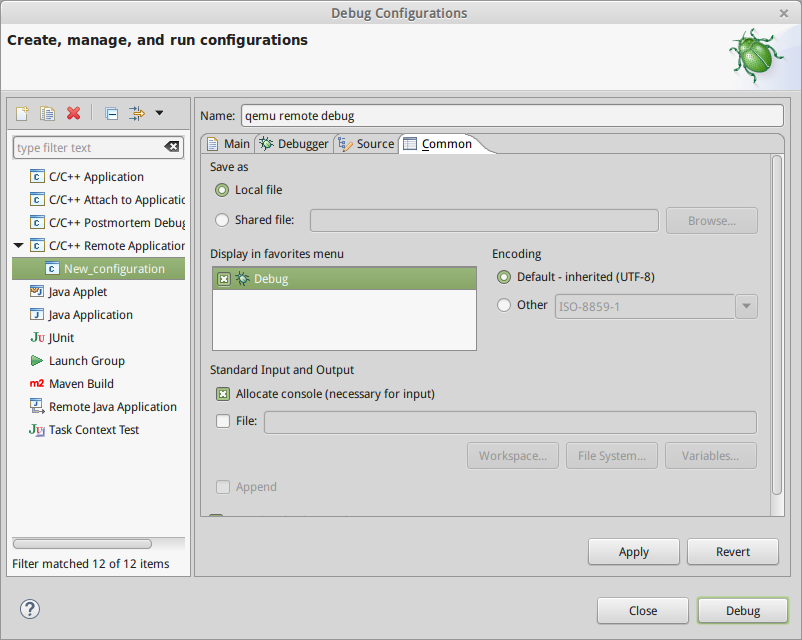
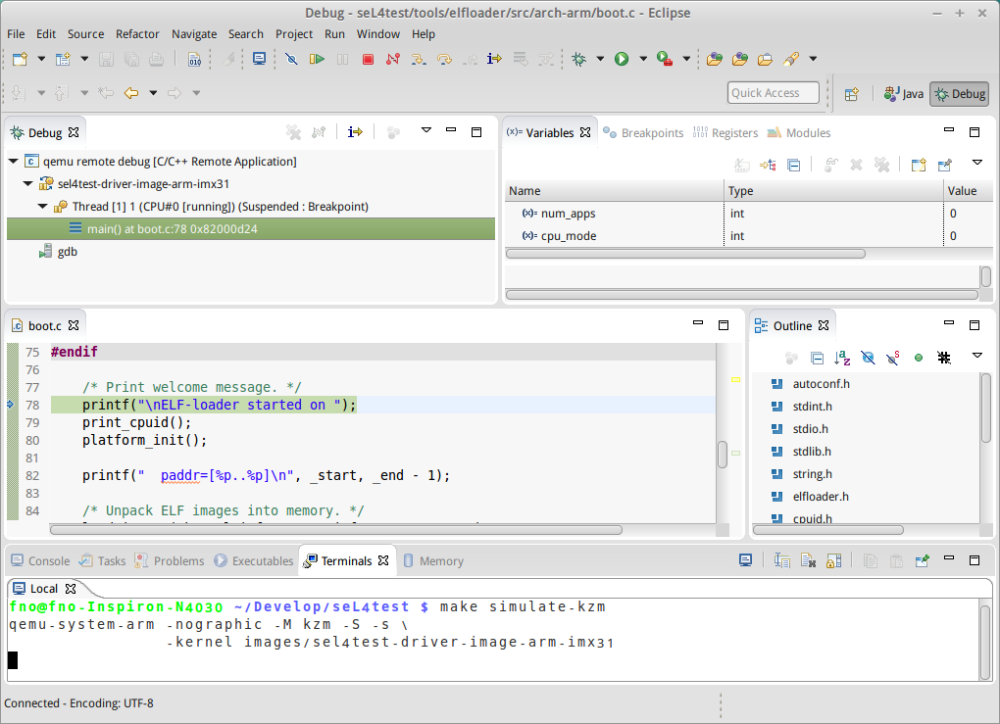

qemu仿真与gdb远程调试
=====================

调试是程序开发中很重要的一环，IDE之所以能提升软件开发效率，很大一方面归功于其提供的强大调试功能。

好的调试工具能够很大程度节省debug的时间。虽然在最恶劣的环境下，程序员可能不得不用最原始的方式去做调试[^1]。
但是，懒惰的人总能创造出各种方法，让调试工作变得简单。

近期，在嵌入式内核移植的工作中遇到了相关的问题。本文主要探讨如何使用qemu仿真器和gdb的远程调试功能，
帮助开发者更好地进行内核级的断点调试。

## 问题分析

我们调试的工程是一个基于seL4微内核的测试工程HD-Elastos，工程的源码可以从以下git得到：

```shell
git clone http://elastos.org/review/HD-Elastos
```

这个工程是参考了[sel4test](https://github.com/seL4/sel4test)工程的代码结构而来的，
构建之后会在`goose/images`目录中生成一个elf格式的镜像。
但是在构建的过程中，`goose/build`目录和`goose/stage`目录中保存了中间生成的一些目标。
其中`goose/stage`目录包含了几个带gdb调试信息的重要目标：

-----------------------------------  ----------------------------------------
`arm/$(PLAT)/kernel.elf`             包含所有seL4内核的调试信息
`arm/$(PLAT)/bin/sel4test-driver`    包含主线程`sel4test-driver`的调试信息
`arm/$(PLAT)/bin/sel4test-tests`     包含主线程`sel4test-tests`的调试信息
-----------------------------------  ----------------------------------------

`goose/images`下生成的最终镜像是通过`make`脚本将以上内容封装在自己的section中，
而最终镜像的`.text`段包含着`goose/tools/elfloader`的内容（含调试信息）。

我们的策略是利用qemu仿真器执行`goose/images`中的镜像，
而在gdb调试器中加载需要调试的部分的符号，然后通过gdb的远程调试协议对qemu进行调试控制。
关于qemu和gdb合作远程调试的方法参考自CSDN的一篇博客。[^2]

## qemu仿真

我们首先需要通过增加参数设置为qemu开启gdb远程调试支持：

```shell
qemu-system-arm -M <your_marchine> [-nographics] -kernel <kernel_image> -S -s
```

参数解释：

----  ------------------------------------
`-S`  qemu启动时冻结CPU

`-s`  `-gdb tcp::1234`的简写，等待gdb通过
      TCP端口1234进行远程调试连接
----  ------------------------------------

## gdb远程调试

gdb支持来自远程TCP端口的调试控制，这一般需要远程通过gdbserver进行端口监听。[^3]
而qemu已支持gdbserver的端口监听功能，通过上面的方法运行qemu便可以进行远程调试。

### arm-none-eabi-gdb

但我们的镜像是面向arm架构的，所以必须使用面向arm指令集的gdb才能进行调试控制。

如果你使用的是debian衍生的linux发行版，apt软件源里应该已包含arm-none-eabi的完整工具链。
你可以直接安装：

```shell
sudo apt-get install gdb-arm-none-eabi
```

其它linux发行版类似。

> **NOTE:** 但是似乎Ubuntu的软件源里，对于该package的封包是有问题的。[^4]
> 似乎`gdb-arm-none-eabi`包中的`arm-none-eabi-gdb`被命名成了`gdb`，
> 和标准平台的`gdb`发生了名称冲突。
> 
> 你当然可以通过对package解包重命名的方式解决冲突，
> 如果你不希望因这样的操作而导致apt的依赖链断裂，
> 你也可以下载预编译的`arm-none-eabi`工具链。

[这里](http://elastos.org/download/files/DevelopmentTools/arm-2013.11-24-arm-none-eabi-i686-pc-linux-gnu.tar.bz2)
有一份可用的预编译包。你不需要安装，解包后直接调用的`bin`目录中的`arm-none-eabi-gdb`即可使用。

如果你没有安装其它版本的`gdb-arm-none-eabi`，你可以在搜索路径中建立一个软链接来指向`arm-none-eabi-gdb`。

```shell
tar jxvf arm-2013.11-24-arm-none-eabi-i686-pc-linux-gnu.tar.bz2 /opt/
ln -s /usr/bin/arm-none-eabi-gdb /opt/arm-2013-11/bin/arm-none-eabi-gdb
```

### remote debug

启动gdb：

```
user@localhost:seL4test$ arm-none-eabi-gdb
GNU gdb (Sourcery CodeBench Lite 2012.09-63) 7.4.50.20120716-cvs
Copyright (C) 2012 Free Software Foundation, Inc.
License GPLv3+: GNU GPL version 3 or later <http://gnu.org/licenses/gpl.html>
This is free software: you are free to change and redistribute it.
There is NO WARRANTY, to the extent permitted by law.  Type "show copying"
and "show warranty" for details.
This GDB was configured as "--host=i686-pc-linux-gnu --target=arm-none-eabi".
For bug reporting instructions, please see:
<https://support.codesourcery.com/GNUToolchain/>.
(gdb) 
```

建立远程调试连接：

```
(gdb) target remote :1234
Remote debugging using :1234
0x82000000 in ?? ()
```

加载要调试部分的符号，就可以读取源码信息，添加断点和监视进行调试了。

### 一个实例

下面就对调试sel4test镜像进行实例演示：

参考[qemu仿真]一节，我们修改项目顶层目录的Makefile，找到目标simulate-kzm，
在命令后面追加两个参数：

```make
simulate-kzm:
	qemu-system-arm -nographic -M kzm -S -s \
		-kernel images/sel4test-driver-image-arm-imx31
```

编译并运行镜像：

```
user@localhost:seL4test$ make kzm_simulation_debug_xml_defconfig
user@localhost:seL4test$ make
user@localhost:seL4test$ make simulate-kzm
qemu-system-arm -nographic -M kzm -S -s \
		-kernel images/sel4test-driver-image-arm-imx31
```

然后加载elfloader代码段符号，这些信息就在最终镜像中：

```
(gdb) file images/sel4test-driver-image-arm-imx31
A program is being debugged already.
Are you sure you want to change the file? (y or n) y
Reading symbols from /home/fno/Develop/seL4test/images/sel4test-driver-image-arm-imx31...done.
```

现在gdb已经读取了elfloader代码段的调试信息，可以正常的进行断点调试了：

```
(gdb) where    # 查看当前位置
#0  0x82000000 in _start ()
(gdb) b main    # 在main函数入口插入一个断点
Breakpoint 1 at 0x82000d24: file /home/fno/Develop/seL4test/tools/common/../elfloader/src/arch-arm/boot.c, line 78.
(gdb) c    # 运行到断点，指针停在main函数内第一条语句，是一个printf
Continuing.

Breakpoint 1, main ()
    at /home/fno/Develop/seL4test/tools/common/../elfloader/src/arch-arm/boot.c:78
78	    printf("\nELF-loader started on ");
(gdb) n    # 单步运行，这时查看qemu，会发现终端输出了上面printf的内容
79	    print_cpuid();
(gdb) s    # 进入print_cpuid函数内部
print_cpuid ()
    at /home/fno/Develop/seL4test/tools/common/../elfloader/src/arch-arm/cpuid.c:84
84	    cpuid = read_cpuid_id();
(gdb) n
85	    printf("CPU: %s ", cpuid_get_implementer_str(cpuid));
(gdb) info local    # 查看当前栈帧中的局部变量
cpuid = 1092072291
```

elfloader部分很快就会运行结束，它的功能主要是为了加载内核镜像和用户镜像。
而这两部分的调试信息并没有直接装载于最终镜像当中。如果你需要调试这些部分，
必须及时切换符号文件：

```
(gdb) file stage/arm/imx31/kernel.elf 
A program is being debugged already.
Are you sure you want to change the file? (y or n) y

Load new symbol table from "/home/fno/Develop/seL4test/stage/arm/imx31/kernel.elf"? (y or n) y
Reading symbols from /home/fno/Develop/seL4test/stage/arm/imx31/kernel.elf...done.
(gdb) b init_kernel

Breakpoint 2 at 0xf000334c: file /home/fno/Develop/seL4test/kernel/src/arch/arm/kernel/boot.c, line 505.
(gdb) c
Continuing.

Breakpoint 2, init_kernel (ui_p_reg_start=2147704832, 
    ui_p_reg_end=2150801408, pv_offset=-2147295232, v_entry=77348)
    at /home/fno/Develop/seL4test/kernel/src/arch/arm/kernel/boot.c:505
505	    result = try_init_kernel(ui_p_reg_start,

...

(gdb) file Develop/seL4test/stage/arm/imx31/bin/sel4test-driver 
A program is being debugged already.
Are you sure you want to change the file? (y or n) y

Load new symbol table from "/home/fno/Develop/seL4test/stage/arm/imx31/bin/sel4test-driver"? (y or n) y
Reading symbols from /home/fno/Develop/seL4test/stage/arm/imx31/bin/sel4test-driver...done.
(gdb) b main
Note: breakpoint 1 also set at pc 0x81fc.
Breakpoint 3 at 0x81fc: file /home/fno/Develop/seL4test/apps/sel4test-driver/src/main.c, line 433.
(gdb) c
Continuing.

Breakpoint 1, main ()
    at /home/fno/Develop/seL4test/apps/sel4test-driver/src/main.c:433
433	{
(gdb) n
434	    seL4_BootInfo *info = seL4_GetBootInfo();
(gdb) n
442	    simple_default_init_bootinfo(&env.simple, info);
(gdb) info local
info = 0x2fd000
res = <optimized out>
(gdb) p *info
$1 = {nodeID = 0, numNodes = 1, numIOPTLevels = 0, ipcBuffer = 0x2fc000, 
  empty = {start = 1032, end = 65536}, sharedFrames = {start = 0, end = 0}, 
  userImageFrames = {start = 15, end = 771}, userImagePTs = {start = 12, 
    end = 15}, untyped = {start = 771, end = 793}, untypedPaddrList = {
    2147483648, 2150801408, 2150809600, 2150825984, 2150891520, 2151153664, 
    2151677952, 2155872256, 2164260864, 2181038080, 2214592512, 2248146944, 
    2264924160, 2273312768, 2277507072, 2279604224, 2280128512, 2280390656, 
    2280521728, 2280587264, 2280603648, 2280611840, 0 <repeats 145 times>}, 
  untypedSizeBitsList = "\020\r\016\020\022\023\026\027\030\031\031\030\027\026\025\023\022\021\020\016\r\f", '\000' <repeats 144 times>, 
  initThreadCNodeSizeBits = 16 '\020', numDeviceRegions = 43, 
  deviceRegions = {{basePaddr = 1140326400, frameSizeBits = 12, frames = {
        start = 793, end = 794}}, {basePaddr = 1140342784, 
      frameSizeBits = 12, frames = {start = 794, end = 795}}, {
      basePaddr = 1140359168, frameSizeBits = 12, frames = {start = 795, 
        end = 796}}, {basePaddr = 1140375552, frameSizeBits = 12, frames = {
        start = 796, end = 797}}, {basePaddr = 1140391936, 
      frameSizeBits = 12, frames = {start = 797, end = 798}}, {
      basePaddr = 1140408320, frameSizeBits = 12, frames = {start = 798, 
        end = 799}}, {basePaddr = 1140424704, frameSizeBits = 12, frames = {
        start = 799, end = 800}}, {basePaddr = 1140441088, 
      frameSizeBits = 12, frames = {start = 800, end = 801}}, {
      basePaddr = 1140457472, frameSizeBits = 12, frames = {start = 801, 
        end = 802}}, {basePaddr = 1140473856, frameSizeBits = 12, frames = {
        start = 802, end = 803}}, {basePaddr = 1140490240, 
      frameSizeBits = 12, frames = {start = 803, end = 804}}, {
      basePaddr = 1140506624, frameSizeBits = 12, frames = {start = 804, 
        end = 805}}, {basePaddr = 1140523008, frameSizeBits = 12, frames = {
        start = 805, end = 806}}, {basePaddr = 1140539392, 
      frameSizeBits = 12, frames = {start = 806, end = 807}}, {
      basePaddr = 1342193664, frameSizeBits = 12, frames = {start = 807, 
        end = 808}}, {basePaddr = 1342210048, frameSizeBits = 12, frames = {
        start = 808, end = 809}}, {basePaddr = 1342226432, 
      frameSizeBits = 12, frames = {start = 809, end = 810}}, {
      basePaddr = 1342242816, frameSizeBits = 12, frames = {start = 810, 
        end = 811}}, {basePaddr = 1342259200, frameSizeBits = 12, frames = {
        start = 811, end = 812}}, {basePaddr = 1342275584, 
      frameSizeBits = 12, frames = {start = 812, end = 813}}, {
      basePaddr = 1342291968, frameSizeBits = 12, frames = {start = 813, 
        end = 814}}, {basePaddr = 1342308352, frameSizeBits = 12, frames = {
        start = 814, end = 815}}, {basePaddr = 1342324736, 
      frameSizeBits = 12, frames = {start = 815, end = 816}}, {
      basePaddr = 1342341120, frameSizeBits = 12, frames = {start = 816, 
        end = 817}}, {basePaddr = 1342423040, frameSizeBits = 12, frames = {
        start = 817, end = 818}}, {basePaddr = 1408761856, 
      frameSizeBits = 12, frames = {start = 818, end = 819}}, {
      basePaddr = 1408778240, frameSizeBits = 12, frames = {start = 819, 
        end = 820}}, {basePaddr = 1408811008, frameSizeBits = 12, frames = {
        start = 820, end = 821}}, {basePaddr = 1408827392, 
      frameSizeBits = 12, frames = {start = 821, end = 822}}, {
      basePaddr = 1408860160, frameSizeBits = 12, frames = {start = 822, 
        end = 823}}, {basePaddr = 1408909312, frameSizeBits = 12, frames = {
        start = 823, end = 827}}, {basePaddr = 1408958464, 
      frameSizeBits = 12, frames = {start = 827, end = 828}}, {
      basePaddr = 1409040384, frameSizeBits = 12, frames = {start = 828, 
        end = 829}}, {basePaddr = 1409073152, frameSizeBits = 12, frames = {
        start = 829, end = 833}}, {basePaddr = 1409089536, 
      frameSizeBits = 12, frames = {start = 833, end = 837}}, {
      basePaddr = 1409122304, frameSizeBits = 12, frames = {start = 837, 
        end = 838}}, {basePaddr = 1409155072, frameSizeBits = 12, frames = {
        start = 838, end = 839}}, {basePaddr = 1409204224, 
      frameSizeBits = 12, frames = {start = 839, end = 840}}, {
      basePaddr = 2684354560, frameSizeBits = 20, frames = {start = 840, 
        end = 904}}, {basePaddr = 2818572288, frameSizeBits = 20, frames = {
        start = 904, end = 936}}, {basePaddr = 3019898880, 
      frameSizeBits = 20, frames = {start = 936, end = 968}}, {
      basePaddr = 3053453312, frameSizeBits = 20, frames = {start = 968, 
        end = 1000}}, {basePaddr = 3221225472, frameSizeBits = 20, frames = {
        start = 1000, end = 1032}}, {basePaddr = 0, frameSizeBits = 0, 
      frames = {start = 0, end = 0}} <repeats 156 times>}, 
  initThreadDomain = 0 '\000'}
```

## 配置调试前端

直接在终端使用gdb固然可以，但对源码本身不熟悉的时候，调试起来效率会很低。
条件允许的情况下，我们还是推荐用前端环境调用gdb调试。

这里有一些可供选择的好用的gdb调试前端。

### gdb for eclipse

eclipse内部集成的debugger调试器，可自定义，配置也相当简单。

下面我们以Eclipse LUNA为例简单介绍配置过程：
（以下过程均假定你已安装Eclipse CDT插件。）

(@) 打开`Run -> Debug Configurations`（或从Toolbar上点debug按钮旁的倒三角进入），
双击左侧的`C/C++ Remote Application`，新建一个debug配置。

    

(@file) 给配置起个名字，在`C/C++ Application`中选择要调试的符号文件路径
（相当于gdb中file命令后的参数）。不需要填写`Project`路径，
`Build Configuration`中选`Disable auto build`（不自动构建）。

    

(@debug) 切换Debug选项卡，取消勾选`Stop on startup at:`（老版本可能不能取消，
但可以将后面的输入框置空），因为后面我们可能要切换符号文件，不同符号文件
包含的入口符号会不一样。在下面的`Main -> GDB debugger:`中选择一个arm版本的
gdb。

    

> **NOTE:** 如果你的arm版gdb已在系统的全局搜索路径中，那么你可以直接输入
> 命令的名字。否则，你可能需要指明一个绝对路径。在用户主目录下添加的变量
> 配置是不生效的，因为Eclipse无法读取`.bashrc`文件中的配置，这个文件是对
> bash环境的。

(@) 仍然在Debug选项卡内，切换到`Debugger Options`的`Connection`子选项卡，
将Port端口号修改为1234。

    

(@) 这一步是可选的。切换到Common选项卡，在`Display in favor menu`中勾选`Debug`。
这会使你能够在Toolbar上点击`Debug`直接选择这一配置，而不需要到`Debug As`中选择。
虽然不这样你仍然可以执行该配置。

    

(@) 应用后关闭。将你的工程导入Eclipse的workspace，然后在你希望的地方插入一个
初始断点（这是因为我们在(@debug)中取消了一个自动的初始断点）。之后从终端运行
qemu来仿真执行你的镜像，你可以用系统的终端，也可以用Eclipse内置的，方法就和
[qemu仿真]一节中介绍的一样。然后就可以点击`Debug`执行你的Debug配置了。之后
镜像会停在你设置的初始断点上，你可以像调试其它本地程序一样插入断点、设置变量
监视或进行单步调试了。

    

(@) 有时你可能需要切换符号文件以调试镜像的不同部分。这可能有些麻烦，目前我还没有
想到好的办法在镜像运行的过程中实现这一点。你可能不得不重新返回(@file)的操作，
在`C/C++ Application`中选择一个新的符号文件，然后重新运行你的qemu和debug。

### vimgdb

待续

### cgdb

待续

Reference
---------

[^1]: 引自《编程人生》
[^2]: [使用Qemu+gdb来调试内核](http://blog.csdn.net/iamljj/article/details/5655169)
[^3]: <http://en.wikipedia.org/wiki/Gdbserver>
[^4]: <https://bugs.launchpad.net/ubuntu/+source/gdb-arm-none-eabi/+bug/1267680>
